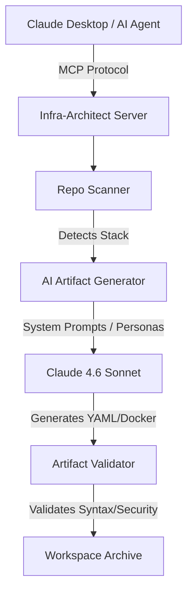

# AI-Infra Architect (MCP-Enabled)

> **Showcase Project for Infra Architect Application MCP Server**

A specialized Model Context Protocol (MCP) server that empowers LLMs to act as Senior DevOps Engineers. It scans local codebases, detects tech stacks (including PHP, Python, Go, Node, and Java), and generates optimized, production-ready Docker and CI/CD configurations for GitHub Actions and Azure DevOps.

## Architecture



## Why This Project?

This tool was built to demonstrate an **AI-First Mindset** specifically aligned with **Infranomics'** methodology:

- **MCP Native:** Integrated with the Model Context Protocol for seamless use with Claude 4.6 Sonnet.
- **Agentic Personas:** Defined system prompts that enforce security and optimization (multi-stage builds, non-root users).
- **Automation:** Automates the repetitive task of containerizing legacy or new projects.
- **AI Steering:** Demonstrates the ability to refine AI outputs through prompt engineering rather than manual code fixes (see [AI_STEERING.md](./AI_STEERING.md)).

## Features

- **Auto-Detection:** Identifies PHP (Laravel), Python (FastAPI/Django), Node, Go, and Java structures.
- **Azure DevOps Support:** Generates multi-stage YAML pipelines specifically for Azure DevOps.
- **Multi-Stage Docker:** Generates optimized, secure multi-stage Dockerfiles.
- **Validation Loop:** Built-in syntax and security validation (multi-stage & non-root checks).

## Installation & Setup

1. **Clone the repository:**

    ```bash
    git clone <repo-url>
    cd ai-repository-architect
    ```

2. **Install dependencies:**

    ```bash
    pip install -r requirements.txt
    ```

3. **Configure MCP:**
   Add the server to your `mcp-config.json` (e.g., in Claude Desktop):
    ```json
    {
        "mcpServers": {
            "infra-architect": {
                "command": "python",
                "args": ["/path/to/ai-repository-architect/src/server.py"],
                "env": {
                    "ANTHROPIC_API_KEY": "your-key-here",
                    "PYTHONPATH": "/path/to/ai-repository-architect"
                }
            }
        }
    }
    ```

## Project Structure

- `src/`: Core logic (Scanner, Generator, Validator, AI Service).
- `prompts/`: Versioned prompt templates (The "Brain").
- `AGENTS.md`: Persona definitions and operational directives.
- `AI_STEERING.md`: Case studies in AI-steered optimization.
- `tests/`: Automated test suites for each development phase.

## Verification

Run the test suite to verify all components:

```bash
python -m pytest tests/
```

## License

MIT
